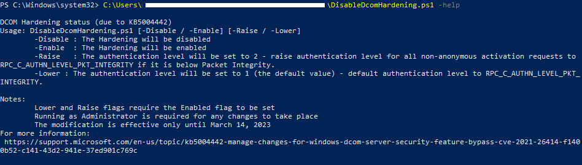

# DCOM Hardening Toolkit
Version 1.0
## Overview
This is a Powershell script for Windows to display retrieve the authentication hardening status of DCOM applications.

The script lists weak DCOM authentication applications installed on the workstation, and provides functionality to increase their security level as well.

For more information:
https://support.microsoft.com/en-us/topic/kb5004442-manage-changes-for-windows-dcom-server-security-feature-bypass-cve-2021-26414-f1400b52-c141-43d2-941e-37ed901c769c

## Usage
Run the script as Administrator, use the -help for the toolkit options 

## Features
* Lists apps that use weak DCOM authentication
* Checks the Registry key `RequireIntegrityActivationAuthenticationLevel` value (if it exists), and optionally can disable or enable it
* (`-Raise` option) Increases the authentication level for applications with low authentication level to 2 (raises authentication level for all non-anonymous activation requests to `RPC_C_AUTHN_LEVEL_PKT_INTEGRITY` if it is below Packet Integrity)
* (`-Lower` option) Decreases the authentication level for applications with higher than 1 authentication level to 1 (the default authentication level for `RPC_C_AUTHN_LEVEL_PKT_INTEGRITY`)

## Authors
Chen Porian from OTORIO's Research Team.